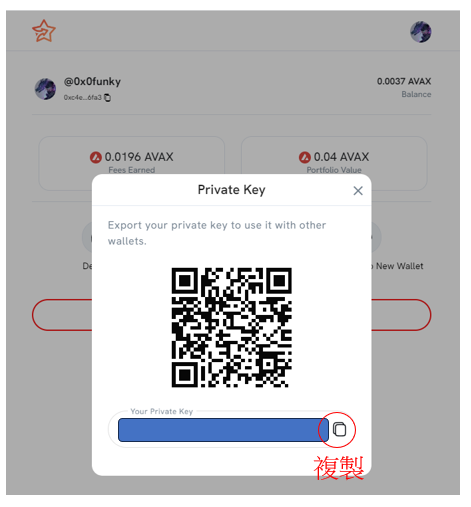
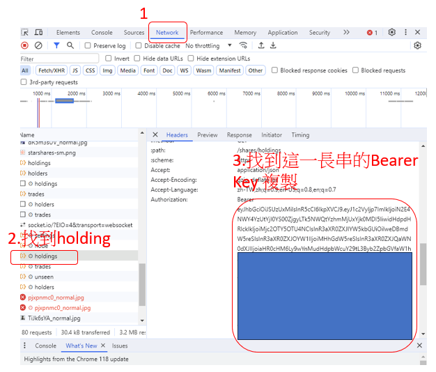

# SA-sellall
 一鍵賣出全部SA KEYS

## 需求

```python 3.10```

## 安裝必要Package
```
pip install web3==5.23.0
```
## 事前設置 (config.ini)
請事先至SA網站設置找到以下資訊並先設定好
```
[DEFAULT]
PRIVATE_KEY = your_private_key_here
BEARER_KEY = your_bearer_key_here
CONTRACT_ADDRESS = 0x563395A2a04a7aE0421d34d62ae67623cAF67D03
REFERRER_ADDRESS = 0x3db941784283891a0e78144c0f3e262afc838bad
```
* REFERRER是邀請碼地址, 目前Default是設定我的, 當作我做這個腳本的Donate
如果你不願意你可以改成自己的 (等於反傭給自己)
* CONTRACT_ADDRESS已確定

## How to run
```
python main.py
```

## PRIVATE_KEY怎麼找?
因為每個人都需要Migrate到新錢包才能交易
先到 "https://starsarena.com/wallet" 按"Migrate" => "Export Private Key"


## Bearer_Key怎麼找?
到 "https://starsarena.com/shares" 按F12, 選擇Network, 然後重新整理, 找到下面這張圖的地方, 複製Bearer Key到程式碼中


## CONTRACT_ADDRESS怎麼找 (已確定)?
已確定 : 0x563395A2a04a7aE0421d34d62ae67623cAF67D03

Produce by 0xFunky
FT: https://friend.tech/0x0funky